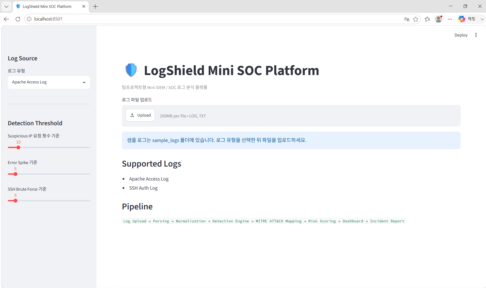
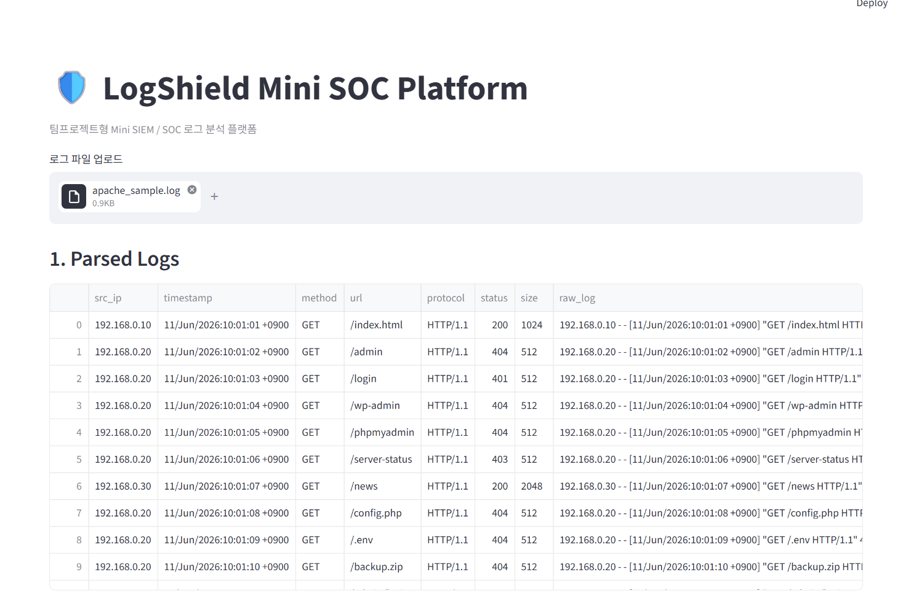
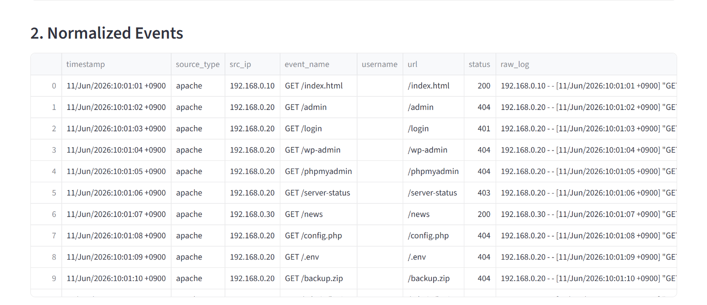
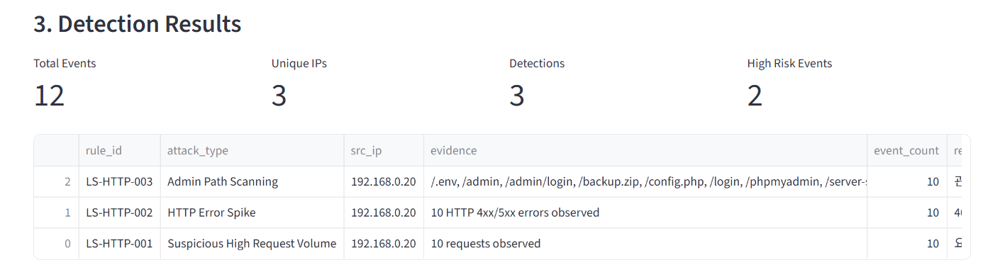
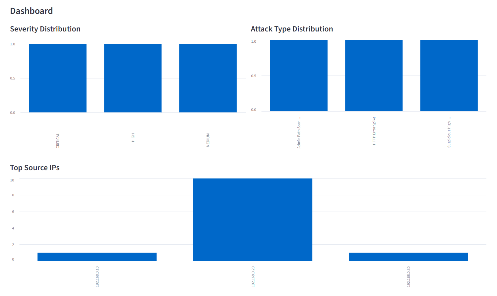
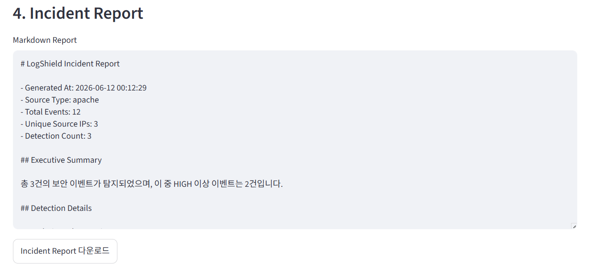

# LogShield Mini SOC Platform

## 프로젝트 개요

최근 다양한 웹 서비스와 서버 환경에서는
Apache, Nginx, SSH 등에서 생성되는 로그를 통해
보안 위협을 탐지하고 대응합니다.

하지만 단순 로그 데이터만으로는
이상 행위를 식별하기 어렵기 때문에
보안관제센터(SOC)에서는 로그 수집,
정규화, 탐지, 분석, 대응의 과정을 수행합니다.

본 프로젝트는 실제 SOC(Security Operations Center)의
로그 분석 프로세스를 모의 구현하기 위해 개발한
Mini SIEM(Security Information and Event Management) 플랫폼입니다.

## 개발 동기

대학교에서 정보보호를 전공하며
침해사고 대응과 로그 분석을 학습하였지만

실제 SOC 환경의 로그 분석 흐름을
직접 구현해본 경험은 부족하다고 느꼈습니다.

이에 따라

- 로그 수집
- 로그 정규화
- 공격 패턴 탐지
- MITRE ATT&CK 매핑
- 위험도 분석
- 사고 리포트 생성

과정을 하나의 플랫폼으로 구현해보고자
본 프로젝트를 진행하였습니다.

## 프로젝트 목표

본 프로젝트의 목표는
실제 보안관제센터의 업무 흐름을
간단하게 재현하는 것입니다.

사용자는 Apache Access Log와
SSH Auth Log를 업로드할 수 있으며

시스템은 로그를 분석하여

- Brute Force 공격
- 관리자 페이지 스캔
- 비정상적인 요청 증가
- 오류 집중 발생

등을 탐지합니다.

탐지 결과는 MITRE ATT&CK와 연결하여
공격 유형을 식별하고
Incident Report를 자동 생성합니다.

## 담당 역할

### Log Parser

- Apache 로그 파서 구현
- SSH Auth 로그 파서 구현

### Detection Engine

- SSH Brute Force 탐지
- Admin Path Scanning 탐지
- HTTP Error Spike 탐지

### SOC Analysis

- MITRE ATT&CK 매핑
- 위험도 산정 로직 구현

### Dashboard

- Streamlit 기반 시각화 구현

### Reporting

- Incident Report 자동 생성
- CSV Export 기능 구현

## Features

- Apache Access Log 분석
- SSH Auth Log 분석
- 로그 정규화
- 규칙 기반 탐지 엔진
- SSH Brute Force 탐지
- Admin Path Scanning 탐지
- HTTP Error Spike 탐지
- MITRE ATT&CK 매핑
- 위험도 점수화
- Streamlit 대시보드
- CSV Export
- Markdown Incident Report 생성

## Tech Stack

- Python
- Streamlit
- Pandas
- Regex
- Rule-based Detection
- MITRE ATT&CK Mapping

## Architecture

```text
Log Upload
    ↓
Parser
    ↓
Normalizer
    ↓
Detection Engine
    ↓
MITRE ATT&CK Mapping
    ↓
Risk Scoring
    ↓
Dashboard
    ↓
Incident Report
```

## Project Structure

```text
logshield-mini-soc-platform
├─ app.py
├─ core
│  ├─ parser.py
│  ├─ normalizer.py
│  ├─ detection_engine.py
│  ├─ mitre_mapper.py
│  └─ risk_score.py
├─ dashboard
│  └─ charts.py
├─ reports
│  └─ report_generator.py
├─ rules
│  └─ detection_rules.yaml
├─ sample_logs
│  ├─ apache_sample.log
│  └─ ssh_sample.log
├─ docs
│  ├─ architecture.md
│  ├─ detection_rules.md
│  └─ team_roles.md
├─ requirements.txt
└─ README.md
```

## How to Run

### 1. 가상환경 생성

```powershell
python -m venv venv
.\venv\Scripts\Activate.ps1
```

### 2. 라이브러리 설치

```powershell
pip install -r requirements.txt
```

### 3. 실행

```powershell
streamlit run app.py
```

## Sample Logs

`sample_logs` 폴더에 테스트용 로그가 포함되어 있습니다.

- `apache_sample.log`
- `ssh_sample.log`

앱 실행 후 로그 유형을 선택하고 샘플 로그를 업로드하면 탐지 결과를 확인할 수 있습니다.

## Detection Rules

| Rule ID | Attack Type | Source | MITRE ATT&CK |
|---|---|---|---|
| LS-SSH-001 | SSH Brute Force | SSH | T1110 |
| LS-HTTP-001 | Suspicious High Request Volume | Apache | T1498 |
| LS-HTTP-002 | HTTP Error Spike | Apache | T1595 |
| LS-HTTP-003 | Admin Path Scanning | Apache | T1595 |

## Team Role Simulation

| Role | Responsibility |
|---|---|
| Log Parser Engineer | Apache/SSH 로그 파싱 및 정규화 |
| Detection Engineer | Brute Force, Admin Scan, Error Spike 탐지 룰 설계 |
| SOC Analyst | MITRE ATT&CK 매핑, 위험도 분석, 대응 가이드 작성 |
| Dashboard Developer | Streamlit 기반 대시보드 구현 |
| Report Engineer | Incident Report 및 CSV Export 구현 |

## Portfolio Description

LogShield Mini SOC Platform은 실제 보안관제센터의 로그 분석 흐름을 모의 구현한 프로젝트입니다. 로그 파싱, 정규화, 탐지 룰 엔진, MITRE ATT&CK 매핑, 위험도 산정, 리포트 생성을 모듈화하여 SIEM의 기본 구조를 설계했습니다.

## GitHub Commit Example

```powershell
git init
git add .
git commit -m "feat: initialize LogShield mini SOC platform"
git branch -M main
git remote add origin https://github.com/chaery-KANG/logshield-mini-soc-platform.git
git push -u origin main
```

# 실행 결과 (Demo)

## 1. 로그 업로드

Apache Access Log 및 SSH Auth Log 업로드를 지원합니다.

본 시연에서는 Apache Access Log를 업로드하여 보안 이벤트를 분석하였습니다.



---

## 2. 로그 파싱 (Parsing)

업로드된 로그를 구조화하여 분석 가능한 데이터 형태로 변환합니다.

수집 정보

* Source IP
* Timestamp
* HTTP Method
* URL
* Status Code
* Raw Log



---

## 3. 이벤트 정규화 (Normalization)

다양한 로그 형식을 공통 이벤트 스키마로 변환합니다.

정규화 항목

* timestamp
* source_type
* src_ip
* event_name
* username
* url
* status



---

## 4. 탐지 엔진 (Detection Engine)

규칙 기반 탐지 엔진을 활용하여 보안 이벤트를 식별합니다.

탐지 규칙

* LS-HTTP-001 : Suspicious High Request Volume
* LS-HTTP-002 : HTTP Error Spike
* LS-HTTP-003 : Admin Path Scanning

분석 결과

* Total Events : 12
* Unique IPs : 3
* Detection Count : 3
* High Risk Events : 2



---

## 5. Dashboard

탐지 결과를 시각화하여 공격 패턴을 한눈에 파악할 수 있습니다.

제공 기능

* Severity Distribution
* Attack Type Distribution
* Top Source IPs



---

## 6. Incident Report

탐지된 이벤트를 기반으로 Incident Report를 자동 생성합니다.

포함 정보

* Executive Summary
* Detection Details
* Risk Level
* Recommendation



---

## 분석 결과 요약

샘플 Apache 로그 분석 결과, IP 주소 **192.168.0.20** 에서 다수의 관리자 페이지 접근 시도가 탐지되었습니다.

주요 탐지 이벤트

* Admin Path Scanning
* HTTP Error Spike
* Suspicious High Request Volume

공격자는 다음과 같은 민감 경로에 접근을 시도하였습니다.

* /admin
* /login
* /wp-admin
* /.env
* /config.php
* /phpmyadmin
* /backup.zip

이를 통해 공격자가 웹 애플리케이션에 대한 정보 수집(Reconnaissance) 및 취약점 탐색을 수행한 것으로 판단할 수 있습니다.


## Future Improvements

- Windows Event Log 지원
- GeoIP 기반 국가 분석
- Discord Webhook 알림
- Sigma Rule 연동
- MITRE ATT&CK Matrix 시각화
- 장기 로그 저장 및 검색 기능
